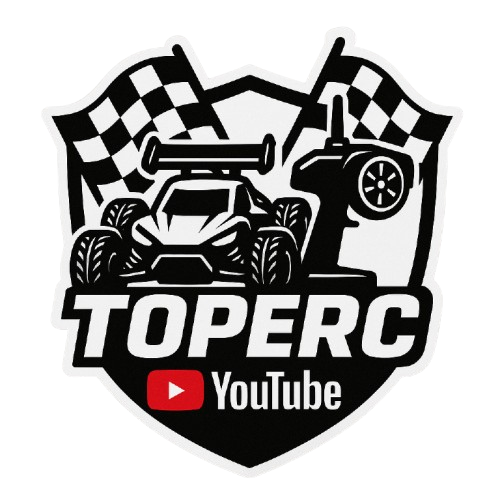

  

  

    <a href="https://www.youtube.com/@TopeRC-es">
      <strong>Watch TopeRC on YouTube / Ver TopeRC en YouTube</strong>
    </a>
  

  

    
  

  <h1>TopeRC</h1>
  

    <strong>Open-source tools for RC telemetry, video overlays, embedded systems, and real-world builds.</strong>
     
    <strong>Herramientas open source para telemetría RC, overlays de video, sistemas embebidos y proyectos reales.</strong>
  

  

    <a href="https://www.youtube.com/@TopeRC-es">YouTube</a> ·
    <a href="https://github.com/toperc">GitHub</a>
  

  

    
    
  

---

## Table of Contents / Índice

- [English](#english)
  - [What we build](#what-we-build)
  - [Featured project](#featured-project)
  - [Follow TopeRC](#follow-toperc)
  - [Contributing](#contributing)
- [Español](#español)
  - [Qué construimos](#qué-construimos)
  - [Proyecto destacado](#proyecto-destacado)
  - [Sigue TopeRC](#sigue-toperc)
  - [Colaborar](#colaborar)

---

## English

TopeRC is an open-source RC engineering organization focused on practical tools for builders, drivers, creators, and developers.

We build software and hardware workflows around radio-control systems: telemetry logging, video overlays, embedded electronics, analysis tools, setup workflows, and documentation that can be used on real projects.

### What we build

| Area | Focus |
| --- | --- |
| Telemetry | Capture, clean, visualize, and analyze RC performance data. |
| Video overlays | Turn RC telemetry logs into graphics ready for editing and publishing. |
| Embedded systems | Reusable firmware, sensors, controllers, and communication modules. |
| FPV and video | Signal, latency, OSD, and workflow experiments for RC content. |
| CAD and fabrication | Printable parts, mounts, enclosures, and reusable build components. |
| Automation and AI | Assistants for setup, analysis, documentation, and content workflows. |

### Featured project

[MT12OverlayStudio](https://github.com/toperc/MT12OverlayStudio) creates frame-accurate transparent video overlays from RadioMaster MT12 telemetry logs.

It helps RC creators and builders load telemetry data, design overlay widgets, preview the result, and export transparent video assets for editing software.

### Follow TopeRC

The TopeRC YouTube channel is where we share RC projects, experiments, tooling, and build progress:

[youtube.com/@TopeRC-es](https://www.youtube.com/@TopeRC-es)

### Contributing

If you are interested in RC cars, electronics, firmware, telemetry, video production, 3D printing, or open tooling, you are welcome here.

Useful ways to help:

- Test tools on real builds and open issues with reproducible data.
- Share telemetry logs, screenshots, setups, and edge cases.
- Improve documentation, translations, firmware, CAD files, or workflows.
- Send focused pull requests that are easy to review and verify.

---

## Español

TopeRC es una organización open source de ingeniería RC centrada en herramientas prácticas para constructores, pilotos, creadores y desarrolladores.

Construimos flujos de trabajo de software y hardware para sistemas de radio control: registro de telemetría, overlays de video, electrónica embebida, herramientas de análisis, ajustes de setup y documentación útil para proyectos reales.

### Qué construimos

| Área | Enfoque |
| --- | --- |
| Telemetría | Capturar, limpiar, visualizar y analizar datos de rendimiento RC. |
| Overlays de video | Convertir logs de telemetría RC en gráficos listos para editar y publicar. |
| Sistemas embebidos | Firmware reutilizable, sensores, controladores y módulos de comunicación. |
| FPV y video | Experimentos con señal, latencia, OSD y flujos de contenido RC. |
| CAD y fabricación | Piezas imprimibles, soportes, carcasas y componentes reutilizables. |
| Automatización e IA | Asistentes para setup, análisis, documentación y creación de contenido. |

### Proyecto destacado

[MT12OverlayStudio](https://github.com/toperc/MT12OverlayStudio) crea overlays de video transparentes y precisos por frame a partir de logs de telemetría de la RadioMaster MT12.

Ayuda a creadores y constructores RC a cargar datos de telemetría, diseñar widgets, previsualizar el resultado y exportar assets transparentes para programas de edición.

### Sigue TopeRC

El canal de YouTube de TopeRC es donde compartimos proyectos RC, pruebas, herramientas y avances:

[youtube.com/@TopeRC-es](https://www.youtube.com/@TopeRC-es)

### Colaborar

Si te interesan los coches RC, la electrónica, el firmware, la telemetría, la producción de video, la impresión 3D o las herramientas abiertas, este espacio también es para ti.

Formas útiles de ayudar:

- Probar herramientas en proyectos reales y abrir issues con datos reproducibles.
- Compartir logs de telemetría, capturas, configuraciones y casos límite.
- Mejorar documentación, traducciones, firmware, archivos CAD o flujos de trabajo.
- Enviar pull requests concretos, fáciles de revisar y verificar.

---

  <strong>Built by makers. Tested on real builds. Shared with the RC community.</strong>
   
  <strong>Hecho por makers. Probado en proyectos reales. Compartido con la comunidad RC.</strong>

